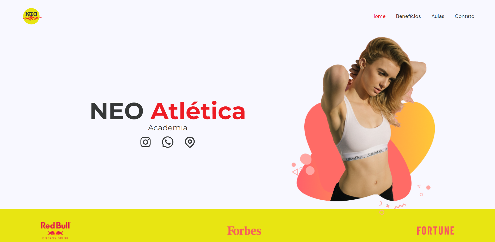

<h1 style="font-weight: bold">NEO Atlética Academia</h1>



 <h2 style="font-weight: bold">🚀 Getting Started</h2>

Para começar com o NEO Atlética Academia, siga os passos abaixo:

### Pré-requisitos

- Node.js instalado em sua máquina local
- npm ou yarn package manager instalado em sua máquina local

<h2 style="font-weight: bold">Installation</h2>

Clone o repositório para a sua máquina local usando git clone https://github.com/aguiarHugo/neo-atletica.git
Navegue até o diretório do projeto usando cd neo-atletica.
Instalando as Dependências
NEO Atlética Academia requer diversas dependências que precisam ser instaladas. Você pode instalá-las usando o gerenciador de pacotes npm ou yarn. Execute o seguinte comando para instalar as dependências:

```
npm install
```
ou
```
yarn install
```

as seguintes dependências serão instaladas:

As seguintes dependências serão instaladas:

#### Dependências

- "@heroicons/react": "^2.0.17"
- "@types/react-anchor-link-smooth-scroll": "^1.0.2"
- "framer-motion": "^10.12.4"
- "react": "^18.2.0"
- "react-anchor-link-smooth-scroll": "^1.0.12"
- "react-dom": "^18.2.0"
- "react-icons": "^4.8.0"

#### Dependências de Desenvolvimento

- "@types/node": "^18.16.1"
- "@types/react": "^18.0.28"
- "@types/react-dom": "^18.0.11"
- "@typescript-eslint/eslint-plugin": "^5.57.1"
- "@typescript-eslint/parser": "^5.57.1"
- "@vitejs/plugin-react": "^4.0.0"
- "autoprefixer": "^10.4.14"
- "eslint": "^8.38.0"
- "eslint-plugin-react-hooks": "^4.6.0"
- "eslint-plugin-react-refresh": "^0.3.4"
- "postcss": "^8.4.23"
- "tailwindcss": "^3.3.2"
- "typescript": "^5.0.2"
- "vite": "^4.3.2"

<h2>🌐 Starting the Development Server</h2>

Depois de instalar as dependências, você pode iniciar o servidor de desenvolvimento com o seguinte comando:

```
npm run dev
```
ou
```
yarn dev
```

Isso iniciará o servidor de desenvolvimento e abrirá a aplicação em seu navegador padrão.

<h2>🏗️ Building the Project</h2>

Para gerar uma build de produção do projeto, utilize o seguinte comando:

```
npm run build
```

ou

```
yarn build
```

This will generate a production-ready build of the application